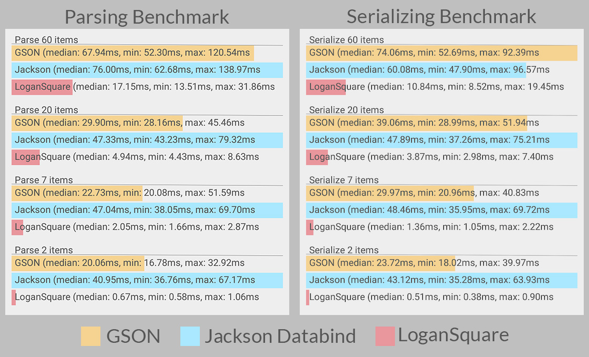

[](https://android-arsenal.com/details/1/1550) [](http://androidweekly.net/issues/issue-141) [](https://travis-ci.org/bluelinelabs/LoganSquare)

#LoganSquare

The fastest JSON parsing and serializing library available for Android. Based on Jackson's streaming API, LoganSquare is able to consistently outperform GSON and Jackson's Databind library by 400% or more<sup>[1](#1)</sup>. By relying on compile-time annotation processing to generate code, you know that your JSON will parse and serialize faster than any other method available.

By using this library, you'll be able to utilize the power of Jackson's streaming API without having to code tedius, low-level code involving `JsonParser`s or `JsonGenerator`s. Instead, just annotate your model objects as a `@JsonObject` and your fields as `@JsonField`s and we'll do the heavy lifting for you.

Don't believe it could improve upon Jackson Databind's or GSON's performance that much? Well, then check out the nifty graphs below for yourself. Not convinced? Feel free to build and run the BenchmarkDemo app included in this repository.

<a name="1"></a>
*<sup>1</sup> <sub>Note: Our "400% or more" performance improvement metric was determined using ART. While LoganSquare still comes out on top with Dalvik, it seems as though the comparison is much closer. The benchmarks shown are actual screenshots taken from a 2nd gen Moto X.<sub>*



##Download

Note that Gradle is the only supported build configuration for LoganSquare. To add the library to your app's build.gradle file.

```groovy
buildscript {
    repositories {
        jcenter()
    }
    dependencies {
        classpath 'com.neenbedankt.gradle.plugins:android-apt:1.8'
    }
}
apply plugin: 'com.neenbedankt.android-apt'

dependencies {
    apt 'com.bluelinelabs:logansquare-compiler:1.3.7'
    compile 'com.bluelinelabs:logansquare:1.3.7'
}

```
For the curious, the buildscript and apply plugin lines add the [apt plugin](https://bitbucket.org/hvisser/android-apt), which is what allows us to do compile-time annotation processing. The first dependency is what tells Gradle to process your JSON annotations, and the second dependency is our tiny 19kb runtime library that interfaces with the generated code for you.

##Usage

Using LoganSquare is about as easy as it gets. Here are a few docs to get you started:

 * [Creating your models](docs/Models.md)
 * [Parsing from JSON](docs/Parsing.md)
 * [Serializing to JSON](docs/Serializing.md)
 * [Supporting custom types](docs/TypeConverters.md)

##Proguard
Like all libraries that generate dynamic code, Proguard might think some classes are unused and remove them. To prevent this, the following lines can be added to your proguard config file.

```
-keep class com.bluelinelabs.logansquare.** { *; }
-keep @com.bluelinelabs.logansquare.annotation.JsonObject class *
-keep class **$$JsonObjectMapper { *; }
```

##Why LoganSquare?

We're BlueLine Labs, a mobile app development company based in Chicago. We love this city so much that we named our company after the blue line of the iconic 'L.' And what's one of the most popular stops on the blue line? Well, that would be Logan Square of course. Does it have anything to do with JSON? Nope, but we're okay with that.

##Props

 * [Jackson's streaming API](https://github.com/FasterXML/jackson-core) for being a super-fast, awesome base for this project.
 * [Instagram's ig-json-parser](https://github.com/Instagram/ig-json-parser) for giving us the idea for this project.
 * [Jake Wharton's Butterknife](https://github.com/JakeWharton/butterknife) for being a great reference for annotation processing and code generation.

##License

    Copyright 2015 BlueLine Labs, Inc.

    Licensed under the Apache License, Version 2.0 (the "License");
    you may not use this file except in compliance with the License.
    You may obtain a copy of the License at

       http://www.apache.org/licenses/LICENSE-2.0

    Unless required by applicable law or agreed to in writing, software
    distributed under the License is distributed on an "AS IS" BASIS,
    WITHOUT WARRANTIES OR CONDITIONS OF ANY KIND, either express or implied.
    See the License for the specific language governing permissions and
    limitations under the License.


